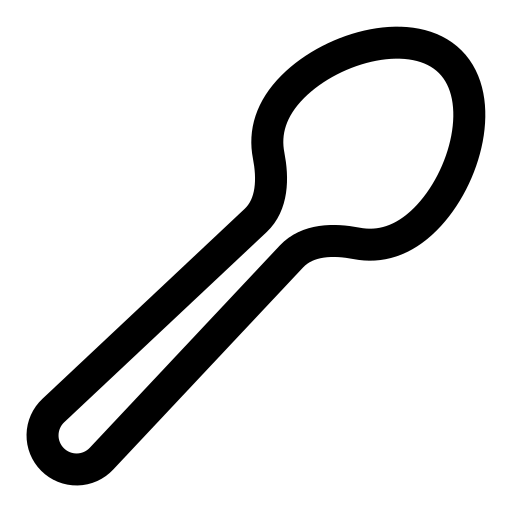

<div align = "center">
  
  <h1>spoon-check</h1>

Describe what is taking your energy, when words are hard.


[](https://discord.gg/jhYWWpNJ3v)

</div>


* Hosted version: https://jamesread.github.io/spoon-check/
* Linux Container version: (see below)

## Feature requests, bugs, or other issues

Feedback is very welcome. Raising a GitHub issue is the best way to communicate :-)

## Design considerations

* Accessibility is very important.
* Use offline (as a "progressive web app"), so it can be installed.

## Self host

### Self host - any webserver

Simply copy the `dist` folder to any webserver. No server side support needed.

You can customize data/icons.json to suit your needs.

### Self host - Docker Container

```
docker run -p 3000:3000 ghcr.io/jamesread/spoon-check
```

## **spoon-check is a No-Nonsense Open Source project;**

- All code and assets are Open Source (AGPL).
- No company is paying for development, there is no paid-for support from the developers.
- No separate core and premium version, no plus/pro version or paid-for extra features.
- No SaaS service or "special cloud version".
- No "anonymous data collection", usage tracking, user tracking, telemetry or email address collection.
- No requests for reviews in any "app store" or feedback surveys.
- No prompts to "upgrade to the latest version".
- No internet-connection required for any functionality.
